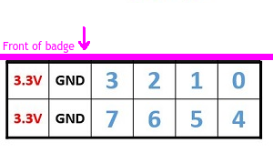

## Connectors

### SAO (Shitty AddOn)

Addon connector following the [SHITTY ADD-ON V1.69BIS standard](https://hackaday.com/2019/03/20/introducing-the-shitty-add-on-v1-69bis-standard/).

| Pin | Description | Direction    | Connection                                       |
|-----|-------------|--------------|--------------------------------------------------|
| 1   | VCC         | Power output | 3.3v supply voltage output                       |
| 2   | GND         | Power output | Ground reference                                 |
| 3   | SDA         | Data IO      | I2C bus data                                     |
| 4   | SCL         | Data output  | I2C bus clock                                    |
| 5   | GPIO1       | Data IO      | User configurable IO, connected to RP2040 GPIO18 |
| 6   | GPIO2       | Data IO      | User configurable IO, connected to RP2040 GPIO19 |

### PMOD (peripheral module interface)

| PMOD pin | ICE40 pin |
|----------|-----------|
| 1        | 47        |
| 2        | 48        |
| 3        | 4         |
| 4        | 2         |
| 7        | 44        |
| 8        | 45        |
| 9        | 3         |
| 10       | 46        |

## Chips

### ESP32

| ESP32 GPIO     | Direction                             | Function                                             | Note                                                                                          |
|----------------|---------------------------------------|------------------------------------------------------|-----------------------------------------------------------------------------------------------|
| 0              | Both                                  | I2S master clock output / UART download select input | Drives I2S DAC / driven by RP2040 through resistor                                            |
| 1              | Output                                | UART TX                                              | Connected to RP2040                                                                           |
| 2              | Both                                  | SD card data 0                                       | SD card slot                                                                                  |
| 3              | Input                                 | UART RX                                              | Connected to RP2040                                                                           |
| 4              | Output                                | I2S channel select (LR)                              |                                                                                               |
| 5              | Output                                | LED data                                             | Connected to the SK6805 LEDs in the kite                                                      |
| 12             | Output                                | I2S clock                                            |                                                                                               |
| 13             | Output                                | I2S data                                             |                                                                                               |
| 14             | Output                                | SD clock                                             | SD card slot                                                                                  |
| 15             | Output                                | SD command                                           | SD card slot                                                                                  |
| 18             | Output                                | SPI clock                                            | Connected to LCD and FPGA                                                                     |
| 19             | Output                                | SD card and kite LED power control                   | Set high to enable power to LEDs and SD card                                                  |
| 21             | Output                                | I2C clock                                            | Connected to RP2040, BNO055, BME680, Qwiic connector and SAO addon connector                  |
| 22             | Both                                  | I2C data                                             | Connected to RP2040, BNO055, BME680, Qwiic connector and SAO addon connector                  |
| 23             | Output                                | SPI MOSI                                             | Data from ESP32 to LCD / FPGA                                                                 |
| 25             | Both                                  | LCD reset                                            | Set to output low to reset LCD, leave floating normally                                       |
| 26             | "Output" (will change on final badge) | LCD mode                                             | Low: LCD in SPI mode, high: LCD in parallel mode                                              |
| 27             | Output                                | SPI chip select for ICE40                            | Low: select ICE40, high: deselect ICE40                                                       |
| 32             | Both                                  | SPI chip select for LCD                              | Low: select LCD, high: deselect LCD. Note: output in LCD SPI mode, input in LCD parallel mode |
| 33             | Both                                  | LCD DC (data or command) selection                   | Note: output in LCD SPI mode, input in LCD parallel mode                                      |
| 34             | Input                                 | Interrupt from RP2040                                |                                                                                               |
| 35             | Input                                 | SPI MISO                                             | Connected to ICE40                                                                            |
| 36 (SENSOR_VP) | Input                                 | Interrupt from position sensor (BNO055)              |                                                                                               |
| 39 (SENSOR_VN) | Input                                 | Interrupt from ICE40 FPGA                            |                                                                                               |

### ICE40 FPGA

to be done

### RP2040

to be done
